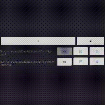

One of banes of my time of earlier years were **memes**. So much so that soundboards were popular for a couple of months when I was in primary school.

This is a project that is about a decade due:

# Button 2
## the custom soundboard

This little app stores files in a database and allows to play and loop thelist of files chosen by a user.
